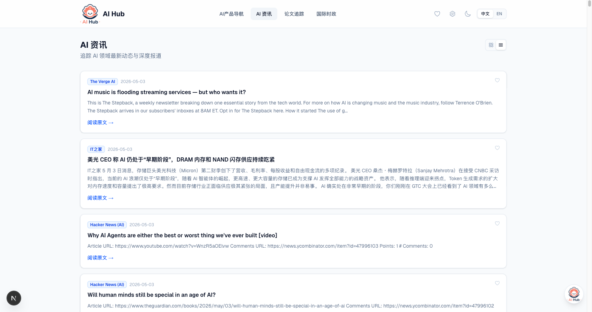

<p align="center">
  
</p>

<h1 align="center">AI Hub</h1>

<p align="center">
  <strong>AI 行业一站式情报平台 / All-in-one AI Industry Intelligence Platform</strong>
</p>

<p align="center">
  <a href="https://ai-hub-zeta-ten.vercel.app">🌐 在线预览 / Live Demo</a> &bull;
  <a href="#-功能特性">中文</a> &bull;
  <a href="#-features">English</a>
</p>

<p align="center">
  
  
  
  
  
</p>

---

<p align="center">
  <a href="https://ai-hub-zeta-ten.vercel.app">
    
  </a>
</p>

---

## 📖 目录 / Table of Contents

- [中文文档](#-中文文档)
- [English Documentation](#-english-documentation)

---

# 🇨🇳 中文文档

## ✨ 功能特性

- **AI 产品导航** — 浏览 100+ AI 公司，支持分类/地区筛选
- **AI 资讯聚合** — 自动从 RSS、网页抓取 AI 新闻，AI 关键词过滤
- **论文追踪** — 追踪 arXiv 前沿研究论文
- **国际时政** — 聚合全球主流媒体国际新闻
- **AI 聊天助手** — 内置 AI 对话，支持 `@提及` 引用文章内容
- **自定义模块** — 创建个性化订阅源组合
- **收藏夹** — 收藏新闻和论文
- **全文搜索** — 跨内容类型搜索
- **数据管线** — 手动或定时（每 4 小时 GitHub Actions）抓取数据
- **中英双语** — 界面支持中文和英文切换
- **深色/浅色主题** — 自动主题切换

<details>
<summary>📸 更多截图</summary>

| AI 资讯 | 设置面板 |
|---------|---------|
|  | 数据抓取、模块管理、数据源、LLM 配置 |

</details>

## 🛠️ 技术栈

| 层级 | 技术 |
|------|------|
| 框架 | Next.js 16 (App Router, Turbopack) |
| 语言 | TypeScript 5 |
| UI | React 19 + Tailwind CSS 4 |
| 数据库 | SQLite（本地）/ Supabase（云端） |
| 数据管线 | RSS Parser + Cheerio + arXiv API |
| AI 对话 | OpenAI 兼容 API（OpenRouter、DeepSeek 等） |
| 定时任务 | GitHub Actions（每 4 小时） |
| 部署 | Vercel |

## 🚀 快速开始

### 环境要求

- Node.js >= 20
- npm 或 pnpm

### 安装

```bash
git clone https://github.com/LearningByDoingNow/ai-hub.git
cd ai-hub
npm install
node scripts/seed-sqlite.mjs   # 初始化数据库
npm run dev                     # 启动开发服务器
```

打开 [http://localhost:3000](http://localhost:3000) 查看。

### 环境变量

创建 `.env.local` 文件：

```env
# LLM 配置（AI 对话功能需要）
LLM_BASE_URL=https://openrouter.ai/api/v1
LLM_API_KEY=your-api-key
LLM_MODEL=deepseek/deepseek-chat-v3-0324:free

# 可选：Supabase（云端部署需要）
NEXT_PUBLIC_SUPABASE_URL=https://your-project.supabase.co
NEXT_PUBLIC_SUPABASE_ANON_KEY=your-anon-key
SUPABASE_SERVICE_ROLE_KEY=your-service-role-key
```

> **提示：** 本地开发 SQLite 开箱即用，Supabase 仅在云端部署（如 Vercel）时需要。

### 数据抓取

```bash
npm run fetch          # 抓取新闻
npm run fetch:papers   # 抓取论文
npm run fetch:all      # 全部抓取
npm run fetch:schedule # 定时抓取（每 4 小时）
```

## 📦 部署

### Vercel（推荐）

1. 推送代码到 GitHub
2. 在 [vercel.com](https://vercel.com) 导入仓库
3. 添加环境变量：`NEXT_PUBLIC_SUPABASE_URL`、`NEXT_PUBLIC_SUPABASE_ANON_KEY`、`SUPABASE_SERVICE_ROLE_KEY`
4. 部署

> 当 SQLite 不可用时（serverless 环境），应用自动切换到 Supabase。

### Supabase 配置

1. 在 [supabase.com](https://supabase.com) 创建项目
2. 在 SQL Editor 中执行 `scripts/create-tables.sql`
3. 配置环境变量

## 📁 项目结构

```
src/
├── app/                  # 页面 & API 路由（Next.js App Router）
│   ├── api/              # RESTful API
│   ├── news/             # 新闻页
│   ├── papers/           # 论文页
│   ├── providers/        # AI 产品目录
│   ├── favorites/        # 收藏
│   ├── feed/[id]/        # 自定义模块
│   └── settings/         # 设置面板
├── components/           # React 组件
├── lib/                  # 核心逻辑（数据库、查询）
├── i18n/                 # 国际化（中文/英文）
└── types/                # TypeScript 类型

scripts/
├── engine.mjs            # 新闻抓取引擎
├── fetch-papers.mjs      # arXiv 论文抓取
├── fetchers/             # 模块化抓取策略
└── create-tables.sql     # 数据库建表
```

### 数据流

```
RSS / 网页 / arXiv
       │
       ▼
 抓取引擎 (scripts/)
       │
       ▼
 SQLite (本地) ──同步──▶ Supabase (云端)
       │                       │
       ▼                       ▼
 本地开发服务器          Vercel 生产环境
```

---

# 🇺🇸 English Documentation

## ✨ Features

- **AI Provider Directory** — Browse 100+ AI companies with category/region filtering
- **News Aggregation** — Auto-fetch from RSS feeds and web scraping with AI keyword filtering
- **Paper Tracking** — Follow cutting-edge research from arXiv
- **World Affairs** — Aggregate international news from major global media
- **AI Chat Assistant** — Built-in chat with `@mention` article context
- **Custom Modules** — Create personalized feed combinations
- **Favorites** — Bookmark news and papers
- **Full-text Search** — Search across all content types
- **Data Pipeline** — Manual or scheduled (every 4h via GitHub Actions) fetching
- **i18n** — Chinese and English interface
- **Dark / Light Theme** — Automatic theme switching

## 🛠️ Tech Stack

| Layer | Technology |
|-------|-----------|
| Framework | Next.js 16 (App Router, Turbopack) |
| Language | TypeScript 5 |
| UI | React 19 + Tailwind CSS 4 |
| Database | SQLite (local) / Supabase (cloud) |
| Data Pipeline | RSS Parser + Cheerio + arXiv API |
| AI Chat | OpenAI-compatible API (OpenRouter, DeepSeek, etc.) |
| Scheduling | GitHub Actions (every 4h) |
| Deployment | Vercel |

## 🚀 Getting Started

### Prerequisites

- Node.js >= 20
- npm or pnpm

### Installation

```bash
git clone https://github.com/LearningByDoingNow/ai-hub.git
cd ai-hub
npm install
node scripts/seed-sqlite.mjs   # Initialize database
npm run dev                     # Start dev server
```

Open [http://localhost:3000](http://localhost:3000) in your browser.

### Environment Variables

Create a `.env.local` file:

```env
# LLM Configuration (required for AI chat)
LLM_BASE_URL=https://openrouter.ai/api/v1
LLM_API_KEY=your-api-key
LLM_MODEL=deepseek/deepseek-chat-v3-0324:free

# Optional: Supabase (for cloud deployment)
NEXT_PUBLIC_SUPABASE_URL=https://your-project.supabase.co
NEXT_PUBLIC_SUPABASE_ANON_KEY=your-anon-key
SUPABASE_SERVICE_ROLE_KEY=your-service-role-key
```

> **Note:** SQLite works out of the box locally. Supabase is only needed for cloud deployment (e.g., Vercel).

### Data Fetching

```bash
npm run fetch          # Fetch news
npm run fetch:papers   # Fetch papers
npm run fetch:all      # Fetch everything
npm run fetch:schedule # Scheduled fetching (every 4h)
```

## 📦 Deployment

### Vercel (Recommended)

1. Push to GitHub
2. Import the repo on [vercel.com](https://vercel.com)
3. Add env vars: `NEXT_PUBLIC_SUPABASE_URL`, `NEXT_PUBLIC_SUPABASE_ANON_KEY`, `SUPABASE_SERVICE_ROLE_KEY`
4. Deploy

> The app automatically uses Supabase when SQLite is not available (serverless environments).

### Supabase Setup

1. Create a project on [supabase.com](https://supabase.com)
2. Run `scripts/create-tables.sql` in the SQL editor
3. Add Supabase credentials to environment variables

## 📁 Architecture

```
src/
├── app/                  # Pages & API routes (Next.js App Router)
│   ├── api/              # RESTful API endpoints
│   ├── news/             # News listing
│   ├── papers/           # Papers listing
│   ├── providers/        # AI provider directory
│   ├── favorites/        # Bookmarked items
│   ├── feed/[id]/        # Custom module feeds
│   └── settings/         # Configuration dashboard
├── components/           # React components
├── lib/                  # Core logic (database, queries)
├── i18n/                 # Internationalization (zh/en)
└── types/                # TypeScript interfaces

scripts/
├── engine.mjs            # News fetching engine
├── fetch-papers.mjs      # arXiv paper fetcher
├── fetchers/             # Modular fetch strategies
└── create-tables.sql     # Database schema
```

### Data Flow

```
RSS Feeds / Web / arXiv
        │
        ▼
  Fetch Engine (scripts/)
        │
        ▼
  SQLite (local) ──sync──▶ Supabase (cloud)
        │                        │
        ▼                        ▼
  Dev Server              Vercel Production
```

---

## 📜 Available Scripts

| Script | Description |
|--------|-------------|
| `npm run dev` | Start development server / 启动开发服务器 |
| `npm run build` | Production build / 构建生产版本 |
| `npm run start` | Run production server / 运行生产服务器 |
| `npm run lint` | Run ESLint / 运行代码检查 |
| `npm run fetch` | Fetch news once / 抓取新闻 |
| `npm run fetch:papers` | Fetch papers once / 抓取论文 |
| `npm run fetch:all` | Fetch everything / 全部抓取 |
| `npm run fetch:schedule` | Scheduled fetching (every 4h) / 定时抓取 |

## 🤝 Contributing

1. Fork the repo
2. Create a feature branch (`git checkout -b feat/amazing-feature`)
3. Commit your changes (`git commit -m 'feat: add amazing feature'`)
4. Push to the branch (`git push origin feat/amazing-feature`)
5. Open a Pull Request

## 📄 License

[MIT License](LICENSE)
