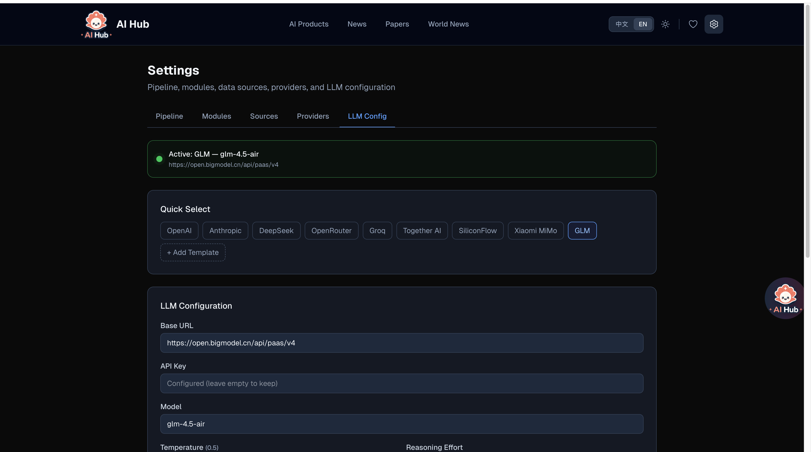

<p align="center">
  
</p>

<h1 align="center">AI Hub</h1>

<p align="center">
  <strong>AI-Powered Global Information Aggregation Platform</strong><br/>
  <sub>AI 驱动的全球信息聚合平台 — 智能抓取、过滤、聚合，重要的事不错过</sub>
</p>

<p align="center">
  <a href="#quick-start">Quick Start</a> •
  <a href="#features">Features</a> •
  <a href="#desktop-widget">Desktop Widget</a> •
  <a href="docs/TECHNICAL.md">Tech Docs</a> •
  <a href="docs/USER_GUIDE.md">User Guide</a> •
  <a href="README.zh-CN.md">中文</a>
</p>

---

## Preview

<p align="center">
  
</p>

<details>
<summary><strong>Dark Mode</strong></summary>

</details>

---

## What is AI Hub?

AI Hub automatically aggregates content from **70+ premium global sources** across multiple domains — AI technology, academic papers, international affairs, and more. It features a modern WebUI and a native macOS desktop widget, both powered by the same data engine.

**Two ways to use:**
- **WebUI** — Full-featured web interface with search, settings, AI chat
- **Desktop Widget** — Lightweight floating widget with real-time notifications

Both share the same database and configuration. Use one or both.

---

## Features

### Intelligent Aggregation Engine
- **70+ curated data sources** — OpenAI, DeepMind, TechCrunch, BBC, Financial Times, arXiv, and more
- **Smart filtering** — AI-relevance detection, 7-day freshness window, duplicate prevention
- **Parallel fetching** — All sources fetched concurrently with 30s deadline, completes in ~8 seconds
- **Configurable auto-fetch** — Set any interval (1min to hours), runs in background

### WebUI

#### AI News Aggregation
Real-time AI news from top sources with precise publish timestamps and freshness indicators.


#### Paper Tracker
Track cutting-edge research papers from arXiv (cs.AI, cs.LG, cs.CL, cs.CV).


#### World News
International affairs coverage from BBC, Financial Times, NYT, Guardian, and more.


#### AI Products Directory
Browse 59+ AI companies across 9 categories with direct links to official sites and APIs.


#### AI Chat Assistant
Streaming AI chat with `@` article references — ask questions about any article in the platform.


#### Settings & Configuration
Configure LLM, manage data sources, set auto-fetch intervals, and more.


<details>
<summary><strong>LLM Configuration</strong></summary>

</details>

---

### Desktop Widget (macOS)

A native floating widget that lives on your desktop — always accessible, never in the way.

<table>
<tr>
<td width="50%">
<strong>Floating Logo with Effects</strong><br/>

<br/><sub>Orbital particles, rainbow aura, sparkle effects</sub>
</td>
<td width="50%">
<strong>Expanded Card List</strong><br/>

<br/><sub>Click logo to expand, click outside to collapse</sub>
</td>
</tr>
<tr>
<td width="50%">
<strong>Full Desktop View</strong><br/>

<br/><sub>Widget + Settings + AI Chat side by side</sub>
</td>
<td width="50%">
<strong>AI Assistant</strong><br/>

<br/><sub>Streaming chat with @ article references</sub>
</td>
</tr>
</table>

---

## Quick Start

### Prerequisites
- **Node.js** 18+ (recommend 20+)
- **npm** 9+

### Installation

```bash
git clone https://github.com/LearningByDoingNow/ai-hub.git
cd ai-hub
npm install        # Installs deps + auto-initializes database with default sources
```

### Configure LLM (Optional, for AI Chat)

```bash
cp .env.example .env.local
# Edit .env.local with your LLM API key
```

Supports any OpenAI-compatible API (OpenAI, ZhipuAI, DeepSeek, Ollama, etc.)

### Run

```bash
npm run fetch:all  # First fetch — pulls data from all 70+ sources (~8 seconds)
npm run dev        # Start WebUI at http://localhost:3000
```

That's it! Open http://localhost:3000 to see your aggregated content.

### Auto-fetch (Optional)

Set up automatic fetching via:
- **WebUI**: Settings → Data Fetching → Set interval
- **Desktop Widget**: Settings → Set interval
- **Cron job**: `npm run fetch:schedule` (runs every 4 hours)

---

## Desktop Widget

### Build from Source (requires Rust)

```bash
# Install Rust if not already installed
curl --proto '=https' --tlsv1.2 -sSf https://sh.rustup.rs | sh

# Build
npm run desktop:install
npm run desktop:build

# Output:
# .app → desktop/src-tauri/target/release/bundle/macos/AI Hub.app
# .dmg → desktop/src-tauri/target/release/bundle/dmg/AI Hub_0.1.0_aarch64.dmg
```

### Install from DMG

Download from [GitHub Releases](https://github.com/LearningByDoingNow/ai-hub/releases) and drag to Applications.

> Note: DMG includes pre-bundled data (59 companies, 70+ sources). Fetching new data requires the project directory with Node.js.

---

## Architecture

```
ai-hub/
├── src/                  # Next.js WebUI (App Router)
│   ├── app/             # Pages + API routes
│   ├── components/      # React components
│   ├── lib/             # SQLite queries, utilities
│   └── i18n/            # Bilingual translations
├── desktop/              # Tauri Desktop Widget
│   ├── src/             # React frontend
│   └── src-tauri/       # Rust backend
├── scripts/              # Data fetching engine
│   ├── engine.mjs       # Main parallel fetcher
│   ├── fetch-papers.mjs # arXiv paper fetcher
│   └── fetchers/        # RSS, scrape, API strategies
├── data/                 # SQLite database
│   └── ai-hub.db        # Shared by WebUI + Desktop
└── public/              # Static assets
```

### Data Flow

```
RSS/API Sources → engine.mjs (parallel fetch + filter)
                       ↓
              SQLite (data/ai-hub.db)
                   ↙        ↘
          Next.js WebUI    Tauri Desktop Widget
              ↓                    ↓
        Browser (SSR)     Native macOS Window
```

---

## Tech Stack

| Layer | Technology |
|-------|-----------|
| WebUI | Next.js 16, React 19, Tailwind CSS 4 |
| Desktop | Tauri 2, Rust, React, Vite |
| Database | SQLite (better-sqlite3) with WAL mode |
| AI Chat | OpenAI-compatible API, SSE streaming |
| Fetching | rss-parser, parallel with deadline |
| Deploy | Vercel (WebUI), GitHub Releases (Desktop) |

---

## Documentation

- **[Technical Documentation](docs/TECHNICAL.md)** — Architecture deep-dive, database schema, API reference
- **[User Guide](docs/USER_GUIDE.md)** — Feature walkthrough, configuration tips, FAQ

---

## License

[MIT](LICENSE)
