<p align="center">
  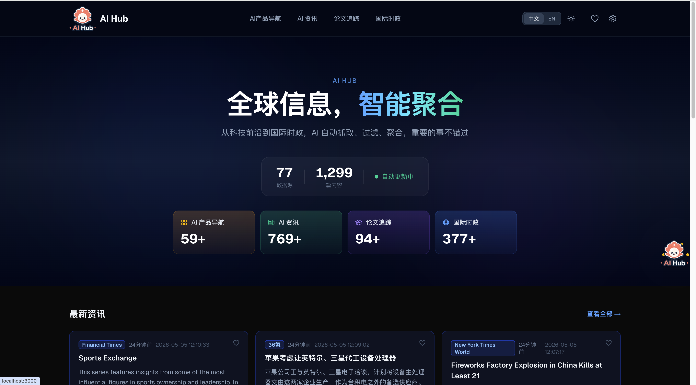
</p>

<p align="center">
  <strong>AI-Powered Global Information Aggregation Platform</strong><br/>
  <sub>Smart fetching, filtering, and aggregation — never miss what matters</sub>
</p>

<p align="center">
  <a href="https://learningbydoingnow.github.io/ai-hub/">Live Preview</a><sup>*</sup> •
  <a href="#quick-start">Quick Start</a> •
  <a href="#features">Features</a> •
  <a href="#desktop-widget">Desktop Widget</a> •
  <a href="docs/TECHNICAL.md">Tech Docs</a> •
  <a href="docs/USER_GUIDE.md">User Guide</a> •
  <a href="README.zh-CN.md">中文</a>
</p>

<sub>* Online preview is a simplified read-only demo. For full features (AI chat, settings, auto-fetch, desktop widget), please clone and run locally.</sub>

---

## What is AI Hub?

AI Hub automatically aggregates content from **77+ premium global sources** across multiple domains — AI technology, academic papers, international affairs, and more. It features a modern WebUI and a native macOS desktop widget, both powered by the same data engine and sharing a unified database.

**Two ways to use:**
- **WebUI** — Full-featured web interface with search, filtering, favorites, settings, AI chat
- **Desktop Widget** — Lightweight floating widget with real-time notifications, favorites, and AI assistant

Both share the same database and configuration — favorites, read status, and sources stay in sync.

---

## Features

### Intelligent Aggregation Engine
- **77+ curated data sources** — OpenAI, DeepMind, TechCrunch, BBC, Financial Times, arXiv, and more
- **Smart filtering** — AI-relevance detection, 7-day freshness window, duplicate prevention
- **Parallel fetching** — All sources fetched concurrently with 30s deadline, completes in ~8 seconds
- **Configurable auto-fetch** — Set any interval (1min to hours), runs in background

---

### WebUI

#### Homepage
Dark-themed dashboard with stats overview, latest news, recent papers, and featured AI products.

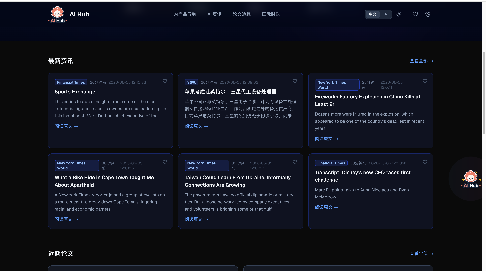

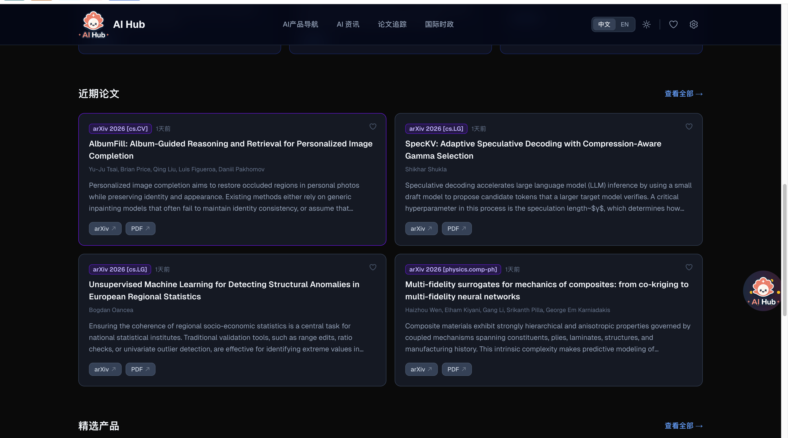

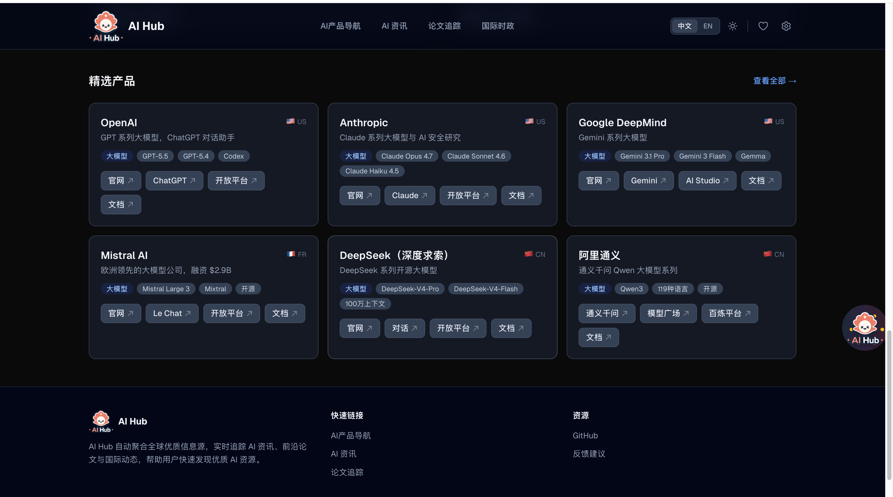

#### AI News Aggregation
Real-time AI news from top sources with source-type filtering (Twitter, WeChat, RSS) and search.

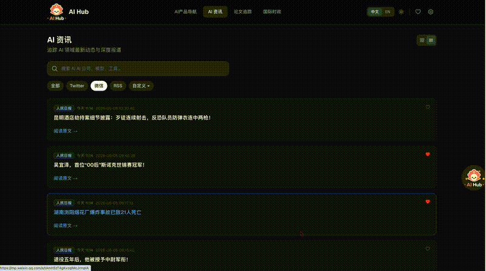

#### Paper Tracker
Track cutting-edge research papers from arXiv (cs.AI, cs.LG, cs.CL, cs.CV) with direct links to papers and PDFs.

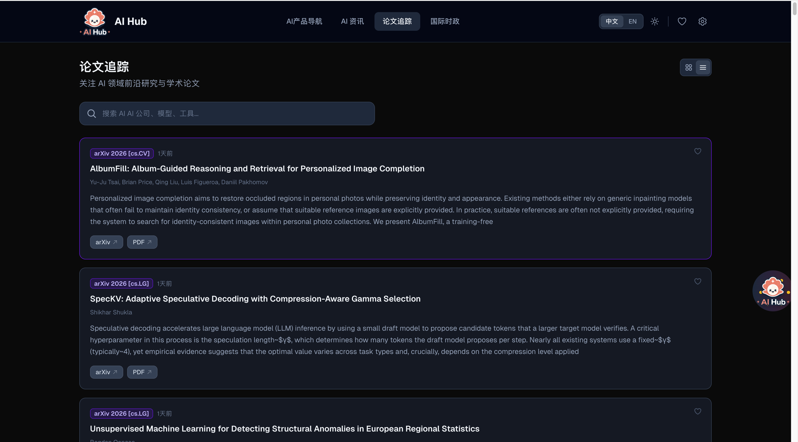

#### World News
International affairs coverage from BBC, Financial Times, NYT, Reuters, Guardian, and more — with source filtering.

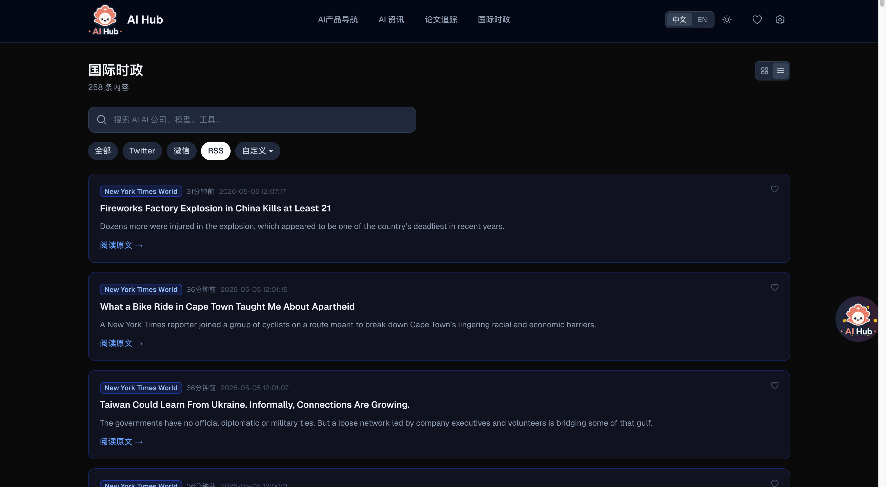

#### AI Products Directory
Browse 59+ AI companies across 9 categories with direct links to official sites, APIs, and documentation.


#### Favorites
Unified favorites system shared between WebUI and Desktop Widget — save and manage your bookmarks.

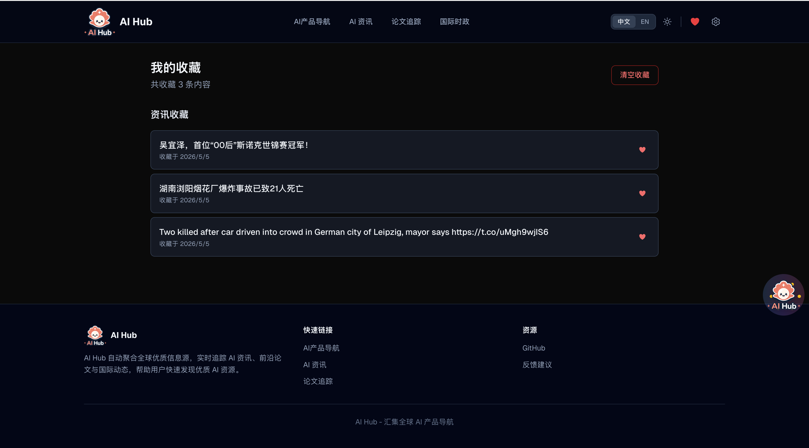

#### Settings & Configuration

Comprehensive settings panel with 5 tabs:

| Tab | Description |
|-----|-------------|
| Data Fetching | One-click fetch, auto-fetch interval, recent fetch history |
| Module Management | Create/edit content modules (AI News, Papers, World News, etc.) |
| Data Sources | Manage 77+ RSS sources, assign to modules |
| Product Management | CRUD for AI products directory |
| LLM Configuration | Quick-select presets (OpenAI, Anthropic, DeepSeek, GLM, etc.) |

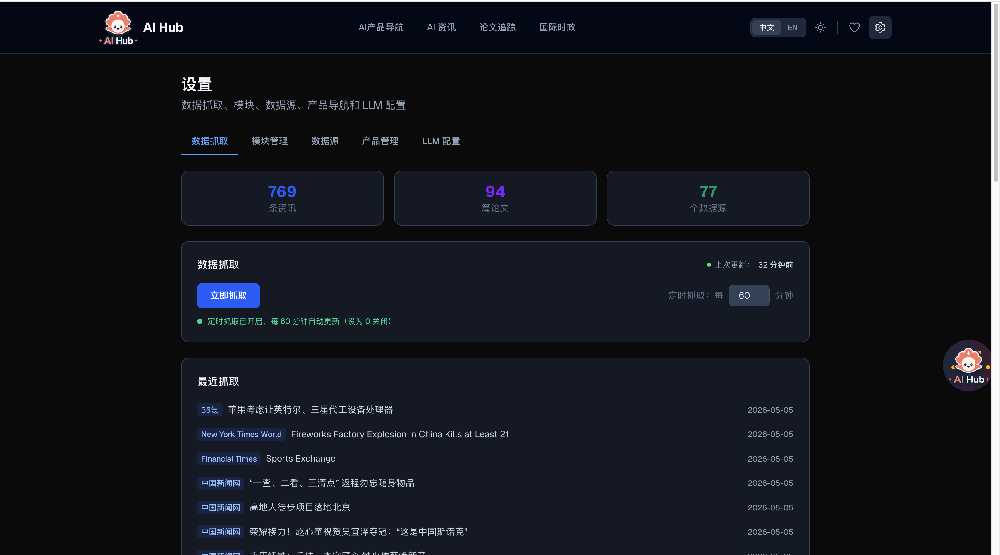
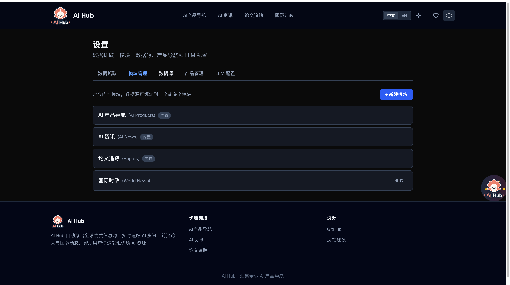
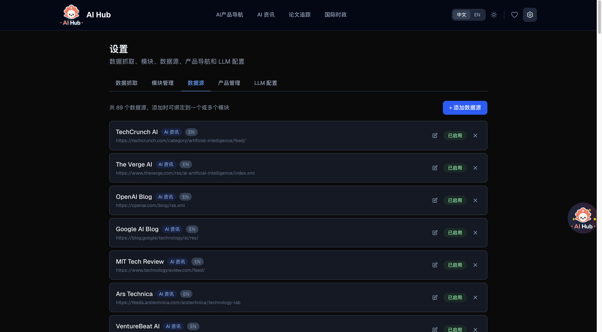
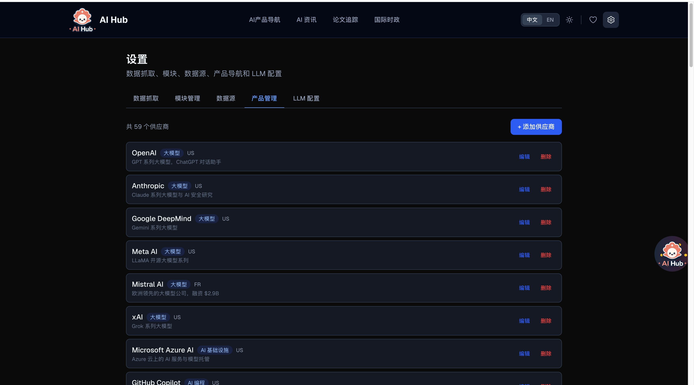
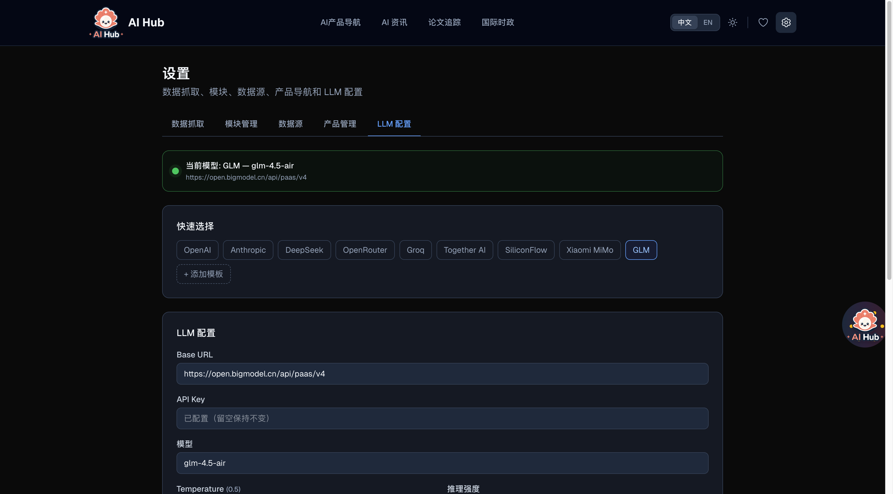

<details>
<summary><strong>Data Fetching Demo</strong></summary>
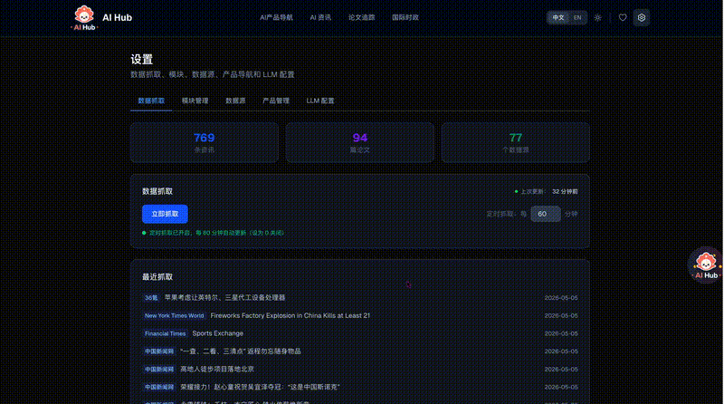
</details>

<details>
<summary><strong>LLM Configuration Demo</strong></summary>
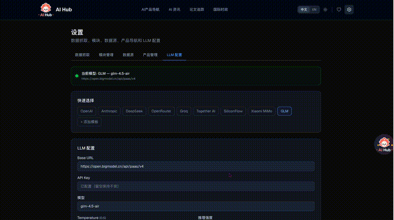
</details>

---

### Desktop Widget (macOS)

A native floating widget that lives on your desktop — always accessible, never in the way.

<table>
<tr>
<td width="50%">
<strong>Expanded Card List</strong><br/>
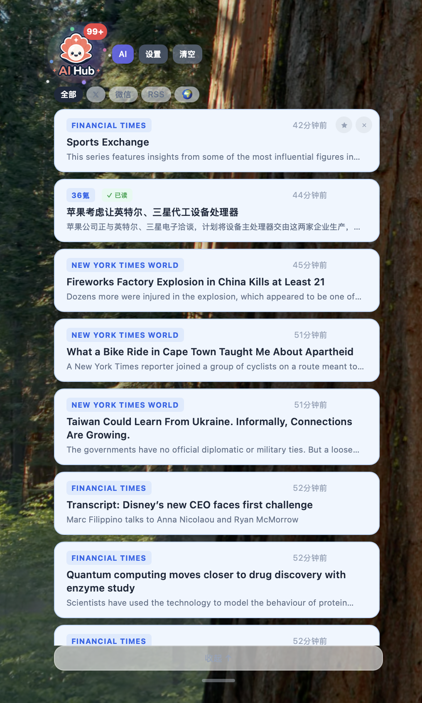
<br/><sub>Read status, favorites, source filtering, dismiss cards</sub>
</td>
<td width="50%">
<strong>Full Desktop View</strong><br/>

<br/><sub>Widget + AI Chat + Settings side by side</sub>
</td>
</tr>
</table>

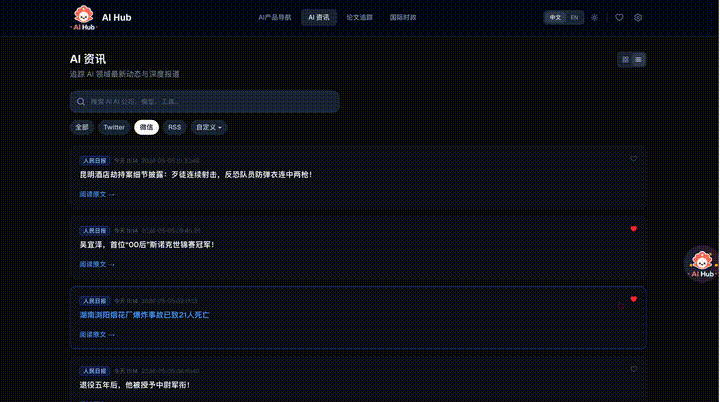

**Widget Features:**
- Floating logo with particle effects — click to expand
- Source-type filter tabs (All, Twitter, WeChat, RSS, World)
- Read tracking (persisted across restarts)
- Favorites (synced with WebUI)
- Dismiss individual cards or clear all
- AI Chat assistant with streaming responses
- Settings panel with LLM configuration
- Drag to reposition, resize by dragging bottom edge

---

## Quick Start

### Prerequisites

| Requirement | Version | Purpose |
|-------------|---------|---------|
| **Node.js** | 18+ (recommend 20+) | WebUI + data fetching engine |
| **npm** | 9+ | Package management |
| **Docker** | (Optional) | WeChat sources via WeWe RSS |
| **Rust** | (Optional) | Build desktop widget from source |

### 1. Clone & Install

```bash
git clone https://github.com/LearningByDoingNow/ai-hub.git
cd ai-hub
npm install        # Installs dependencies + auto-initializes SQLite database with 77+ default sources
```

### 2. First Data Fetch

```bash
npm run fetch:all        # Fetches news + papers from all 77+ sources (~8 seconds)
```

This pulls the latest content into the local SQLite database. You can re-run anytime to get fresh data.

> **About WeChat sources:** The pre-configured WeChat sources (`wx-*`) require WeWe RSS running via Docker (see [WeChat Sources section](#wechat-sources-wewe-rss--docker) below). If you haven't set up Docker/WeWe RSS, these sources will silently fail — **all other 60+ sources (RSS, arXiv, etc.) work normally without Docker.** You can set up WeChat sources later at any time.

### 3. Start WebUI

```bash
npm run dev              # Start development server at http://localhost:3000
```

Open http://localhost:3000 — you'll see all aggregated content immediately.

### 4. Configure LLM (Optional — for AI Chat)

```bash
cp .env.example .env.local
```

Edit `.env.local`:
```env
LLM_BASE_URL=https://open.bigmodel.cn/api/paas/v4   # Or any OpenAI-compatible endpoint
LLM_API_KEY=your_api_key_here
LLM_MODEL=glm-4.5-air                                # Model name
LLM_TEMPERATURE=0.5
```

Supported providers: OpenAI, Anthropic, DeepSeek, GLM (智谱), Together AI, Groq, SiliconFlow, Ollama (local), etc.

You can also configure LLM directly in the WebUI: **Settings → LLM Configuration** (with quick-select presets).

---

## Available Commands

### Data Fetching

| Command | Description |
|---------|-------------|
| `npm run fetch:all` | One-shot: fetch news + papers from all sources (~8s) |
| `npm run fetch` | One-shot: fetch news only |
| `npm run fetch:papers` | One-shot: fetch arXiv papers only |
| `npm run fetch:schedule` | Loop: auto-fetch every 4 hours (runs in foreground) |

### WebUI

| Command | Description |
|---------|-------------|
| `npm run dev` | Start dev server with hot-reload (http://localhost:3000) |
| `npm run build` | Production build |
| `npm run start` | Start production server |

### Desktop Widget

| Command | Description |
|---------|-------------|
| `npm run desktop:install` | Install desktop dependencies |
| `npm run desktop:dev` | Start desktop widget in dev mode (hot-reload) |
| `npm run desktop:build` | Build .app and .dmg for distribution |

### Quick Launch (Full Stack)

Open **3 terminals** for the complete experience:

```bash
# Terminal 1: Start WeWe RSS (if using WeChat sources)
docker start wewe-rss

# Terminal 2: Start WebUI
npm run dev

# Terminal 3: Start Desktop Widget
npm run desktop:dev
```

Or a minimal single-terminal start:
```bash
npm run fetch:all && npm run dev
```

### Auto-fetch Options

| Method | How |
|--------|-----|
| **WebUI** | Settings → Data Fetching → Set interval (e.g., 60 mins) |
| **Desktop Widget** | Settings → Set interval |
| **Terminal** | `npm run fetch:schedule` (every 4 hours, foreground) |
| **System cron** | `crontab -e` → `0 */4 * * * cd /path/to/ai-hub && npm run fetch:all` |

---

## WeChat Sources (WeWe RSS + Docker)

> **This section is entirely OPTIONAL.** If you don't need WeChat public account content, skip this section completely. All other 60+ sources (RSS feeds, arXiv papers, etc.) work out of the box with just `npm install` — no Docker needed.

AI Hub uses [WeWe RSS](https://github.com/cooderl/wewe-rss) to fetch WeChat public account (微信公众号) articles. WeWe RSS is an **independent** open-source project that converts WeChat subscriptions into standard RSS/Atom feeds. It runs as a separate Docker container on your machine.

### Why is Docker needed?

WeChat does not provide official RSS feeds. WeWe RSS acts as a bridge:
- It runs a Docker container with a headless browser
- It periodically scans WeChat accounts you configure
- It exposes the articles as standard Atom feeds at `http://localhost:4000`
- AI Hub then fetches these Atom feeds just like any other RSS source

### Prerequisites

- [Docker Desktop](https://www.docker.com/products/docker-desktop/) installed and running
- A WeChat account for login authentication in WeWe RSS

### Setup Steps

```bash
# Step 1: Pull and start WeWe RSS container
docker run -d \
  --name wewe-rss \
  -p 4000:4000 \
  -e DATABASE_TYPE=sqlite \
  -e AUTH_CODE=your_auth_code \
  -v $(pwd)/wewe-data:/app/data \
  cooderl/wewe-rss:latest

# Step 2: Verify it's running
docker ps | grep wewe-rss

# Step 3: Open the dashboard
open http://localhost:4000
```

In the WeWe RSS dashboard:
1. Log in with the auth code you set above
2. Scan the QR code with your WeChat to authorize
3. Add WeChat public accounts you want to follow (search by name)

### How It Works

```
WeChat Public Accounts
        ↓ (WeWe RSS scans via authorized WeChat)
WeWe RSS (Docker, localhost:4000)
        ↓ (Atom feed: /feeds/MP_WXS_xxxxx.atom)
AI Hub engine.mjs (fetches like regular RSS)
        ↓
SQLite database → WebUI + Desktop Widget
```

### Adding WeChat Sources to AI Hub

AI Hub comes with 10+ WeChat sources pre-configured (pointing to `localhost:4000`). Once WeWe RSS is running and accounts are added, they'll be fetched automatically.

To add more sources manually:
1. In WeWe RSS dashboard → find the feed URL (e.g., `http://localhost:4000/feeds/MP_WXS_3073282833.atom`)
2. In AI Hub → Settings → Data Sources → **+ Add Source**:
   - Name: `机器之心` (display name)
   - URL: the feed URL from WeWe RSS
   - Module: select target module (e.g., "AI News" or "World News")

### Pre-configured WeChat Sources

| Source | Category |
|--------|----------|
| 机器之心, 新智元, 智猩猩AI, 36氪(微信), 电手, 数字生命卡兹克 | AI News |
| 人民日报, 央视军事, 九万里, 外军防务研究前沿 | World News |

### Daily Usage

```bash
# Start WeWe RSS (run once after system reboot)
docker start wewe-rss

# Check status
docker ps | grep wewe-rss

# Stop (when not needed)
docker stop wewe-rss

# View logs (if something goes wrong)
docker logs wewe-rss --tail 50
```

> **If WeWe RSS is not running:** WeChat sources will fail silently during fetch — you'll see fewer results but no errors. All other sources continue working normally.

---

## Desktop Widget

### Run in Development Mode

```bash
# Prerequisites: Rust must be installed
curl --proto '=https' --tlsv1.2 -sSf https://sh.rustup.rs | sh

# First time: install desktop dependencies
npm run desktop:install

# Start desktop widget (dev mode with hot-reload)
npm run desktop:dev
```

The widget will appear as a floating logo on your desktop. Click to expand the card list.

> **Note:** The desktop widget reads from the same `data/ai-hub.db` as the WebUI. Make sure you've run `npm run fetch:all` at least once so there's data to display.

### Build for Distribution

```bash
npm run desktop:build

# Output:
# .app → desktop/src-tauri/target/release/bundle/macos/AI Hub.app
# .dmg → desktop/src-tauri/target/release/bundle/dmg/AI Hub_0.1.0_aarch64.dmg
```

### Install from DMG

Download from [GitHub Releases](https://github.com/LearningByDoingNow/ai-hub/releases) and drag to Applications.

> **macOS Security Warning:** If you see "AI Hub is damaged and can't be opened", run:
> ```bash
> xattr -cr /Applications/AI\ Hub.app
> ```
> This is normal for unsigned apps.

> **DMG Limitations:** The standalone DMG includes pre-bundled data for immediate viewing and AI chat. However, **fetching new data is not available** without the full project directory + Node.js. For full functionality including auto-fetch, clone the repository instead.

---

## Architecture

```
ai-hub/
├── src/                  # Next.js WebUI (App Router)
│   ├── app/             # Pages + API routes
│   ├── components/      # React components
│   ├── lib/             # SQLite queries, utilities
│   └── i18n/            # Bilingual translations
├── desktop/              # Tauri Desktop Widget
│   ├── src/             # React frontend
│   └── src-tauri/       # Rust backend
├── scripts/              # Data fetching engine
│   ├── engine.mjs       # Main parallel fetcher
│   ├── fetch-papers.mjs # arXiv paper fetcher
│   └── fetchers/        # RSS, scrape, API strategies
├── data/                 # SQLite database
│   └── ai-hub.db        # Shared by WebUI + Desktop
└── public/              # Static assets
```

### Data Flow

```
RSS/API Sources → engine.mjs (parallel fetch + filter)
                       ↓
              SQLite (data/ai-hub.db)
                   ↙        ↘
          Next.js WebUI    Tauri Desktop Widget
              ↓                    ↓
        Browser (SSR)     Native macOS Window
```

Both apps read/write the same database — favorites, sources, and configuration stay in sync automatically.

---

## Tech Stack

| Layer | Technology |
|-------|-----------|
| WebUI | Next.js 16, React 19, Tailwind CSS 4 |
| Desktop | Tauri 2, Rust, React, Vite |
| Database | SQLite (better-sqlite3) with WAL mode |
| AI Chat | OpenAI-compatible API, SSE streaming |
| Fetching | rss-parser, parallel with deadline |
| Deploy | Vercel (WebUI), GitHub Releases (Desktop) |

---

## Documentation

- **[Technical Documentation](docs/TECHNICAL.md)** — Architecture deep-dive, database schema, API reference
- **[User Guide](docs/USER_GUIDE.md)** — Feature walkthrough, configuration tips, FAQ

---

## License

[MIT](LICENSE)
