<p align="center">
  
</p>

<h1 align="center">AI Hub</h1>

<p align="center">
  <strong>AI 驱动的全球信息聚合平台</strong><br/>
  <sub>智能聚合全球优质信息源，覆盖科技、学术、国际时政等多领域，让你一站掌握全局动态</sub>
</p>

<p align="center">
  <a href="#快速开始">快速开始</a> |
  <a href="#核心功能">功能介绍</a> |
  <a href="#桌面组件">桌面组件</a> |
  <a href="docs/TECHNICAL.md">技术文档</a> |
  <a href="docs/USER_GUIDE.md">使用指南</a> |
  <a href="README.md">English</a>
</p>

---

## 预览

<p align="center">
  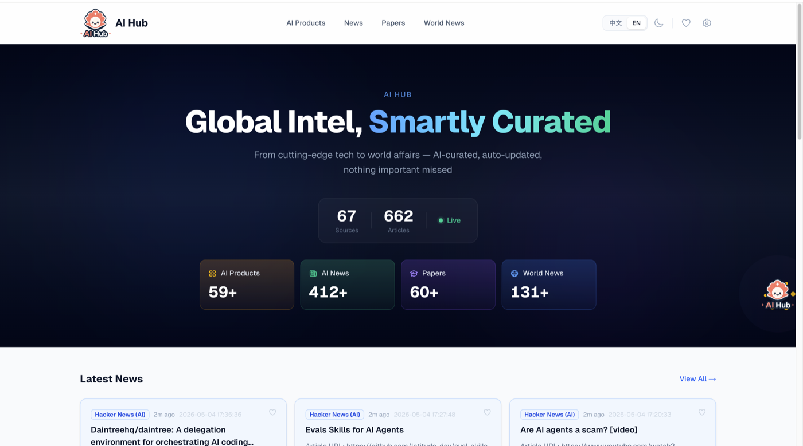
</p>

<details>
<summary><strong>暗黑模式</strong></summary>
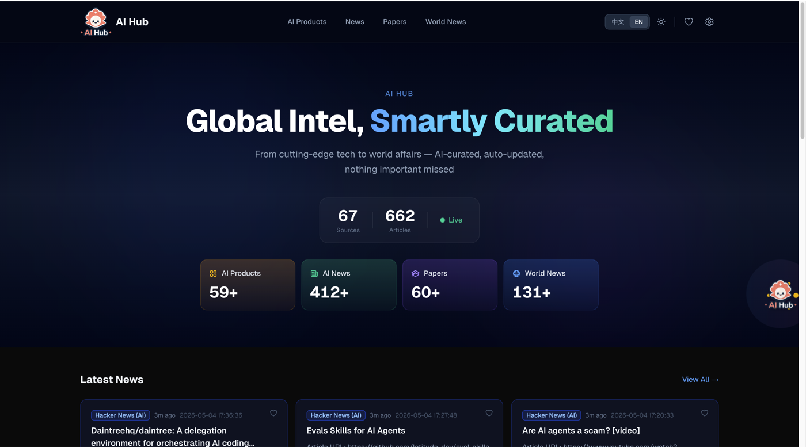
</details>

---

## 项目简介

AI Hub 自动聚合 **70+ 全球优质信息源**的内容，涵盖 AI 科技、学术论文、国际时政等领域。提供现代化 WebUI 和原生 macOS 桌面组件，共享同一数据引擎。

**两种使用方式：**
- **WebUI** — 功能完整的网页界面（搜索、设置、AI 对话、收藏等）
- **桌面组件** — 轻量浮动组件（实时通知、AI 对话、设置）

两者共享相同数据库和配置，可单独使用也可配合使用。

---

## 核心功能

### 智能聚合引擎
- **70+ 精选数据源** — OpenAI、DeepMind、TechCrunch、BBC、金融时报、arXiv 等
- **智能过滤** — AI 相关性检测、7 天时效性窗口、去重
- **并行抓取** — 所有源并发请求，30 秒截止，全部完成仅需 ~8 秒
- **定时自动抓取** — 任意间隔（1 分钟到数小时），后台静默运行

### WebUI 网页端

#### AI 资讯聚合
实时聚合顶级 AI 信息源，精确显示文章发布时间与时效性色彩。

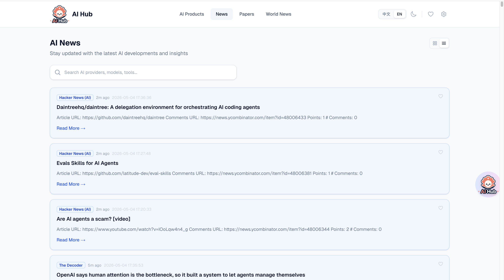

#### 论文追踪
追踪 arXiv 最新论文（cs.AI、cs.LG、cs.CL、cs.CV）。

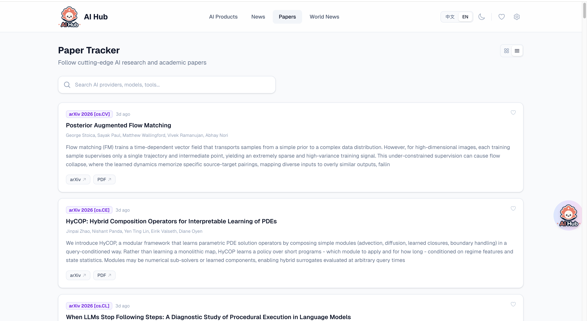

#### 国际时政
BBC、金融时报、纽约时报、卫报等全球新闻覆盖。

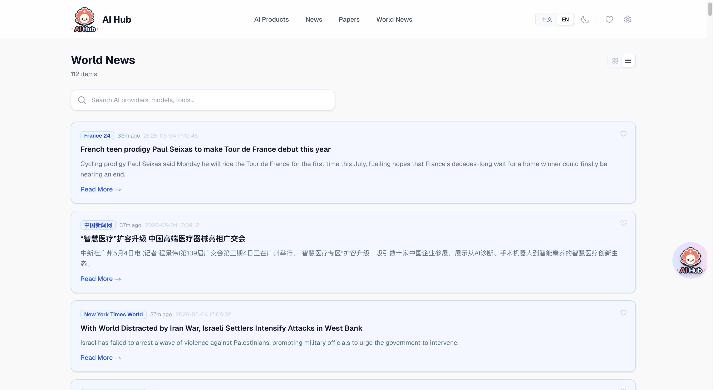

#### AI 产品导航
浏览 59+ AI 公司，9 大分类，直达官网和 API。

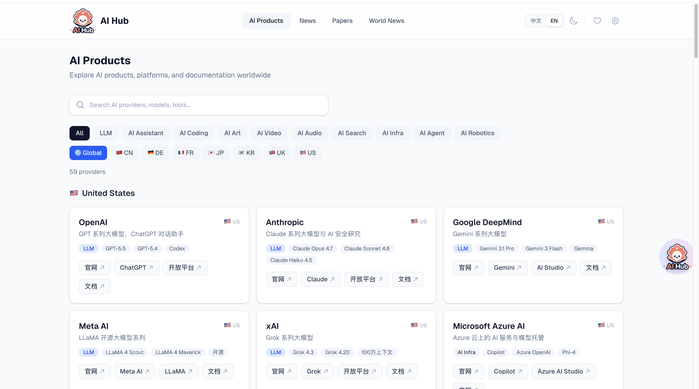

#### AI 智能助手
流式 AI 对话，支持 `@` 引用平台文章进行分析总结。

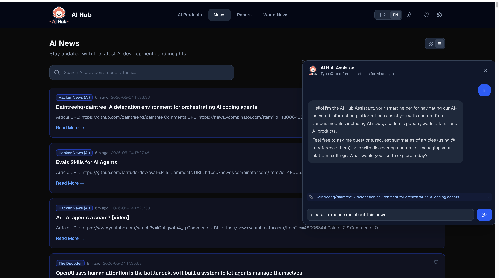

#### 设置与配置
LLM 配置、数据源管理、定时抓取设置。

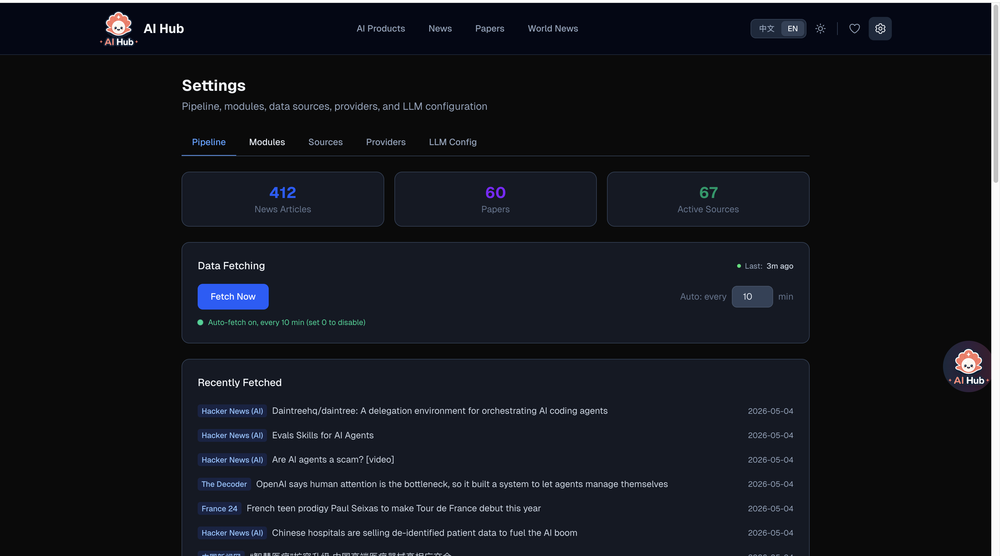

---

### 桌面组件 (macOS)

原生浮动组件，常驻桌面，随时可用。

<table>
<tr>
<td width="50%">
<strong>浮动 Logo 特效</strong><br/>
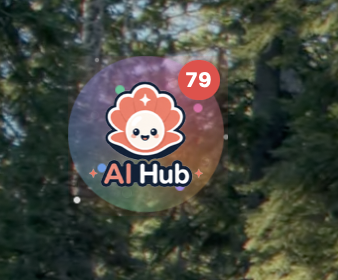
<br/><sub>轨道粒子 + 彩虹光环 + 星光闪烁</sub>
</td>
<td width="50%">
<strong>展开卡片列表</strong><br/>
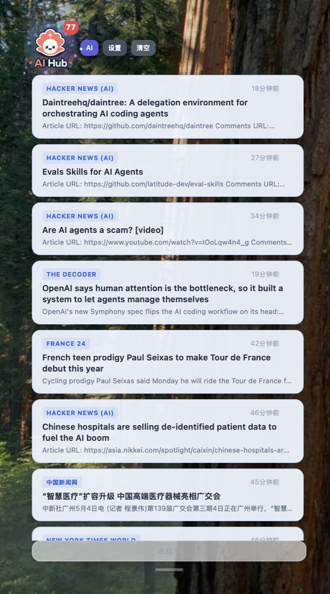
<br/><sub>点击展开，点击外部收起</sub>
</td>
</tr>
<tr>
<td width="50%">
<strong>桌面全景</strong><br/>
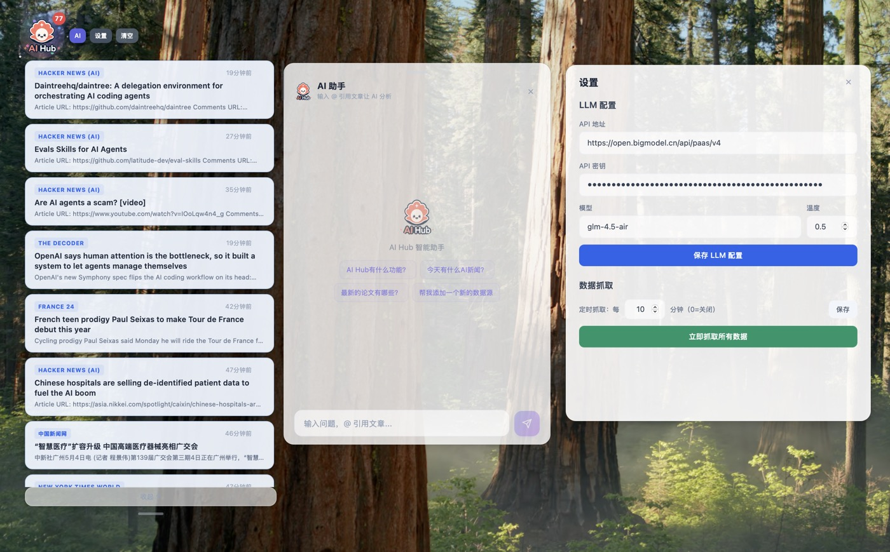
<br/><sub>组件 + 设置 + AI 对话并排使用</sub>
</td>
<td width="50%">
<strong>AI 助手</strong><br/>
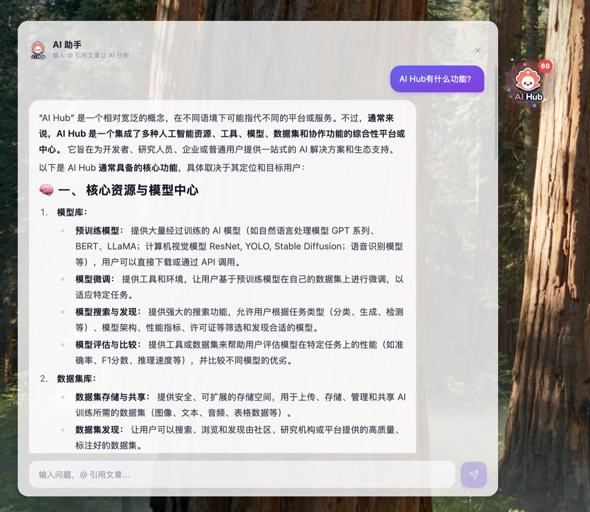
<br/><sub>流式输出 + @ 引用文章分析</sub>
</td>
</tr>
</table>

---

## 快速开始

### 环境要求
- **Node.js** 18+（推荐 20+）
- **npm** 9+

### 安装

```bash
git clone https://github.com/LearningByDoingNow/ai-hub.git
cd ai-hub
npm install        # 安装依赖 + 自动初始化数据库和默认数据源
```

### 配置 LLM（可选，用于 AI 对话）

```bash
cp .env.example .env.local
# 编辑 .env.local 填入你的 LLM API 密钥
```

支持任何 OpenAI 兼容 API（OpenAI、智谱、DeepSeek、Ollama 等）

### 运行

```bash
npm run fetch:all  # 首次抓取（从 70+ 源拉取数据，约 8 秒）
npm run dev        # 启动 WebUI http://localhost:3000
```

打开 http://localhost:3000 即可使用。

---

## 桌面组件

### 从源码构建（需要 Rust）

```bash
curl --proto '=https' --tlsv1.2 -sSf https://sh.rustup.rs | sh  # 安装 Rust
npm run desktop:install
npm run desktop:build
```

### 安装 DMG

从 [GitHub Releases](https://github.com/LearningByDoingNow/ai-hub/releases) 下载，拖入应用程序即可。

---

## 技术栈

| 层次 | 技术 |
|------|------|
| 网页端 | Next.js 16, React 19, Tailwind CSS 4 |
| 桌面端 | Tauri 2, Rust, React, Vite |
| 数据库 | SQLite (better-sqlite3) WAL 模式 |
| AI 对话 | OpenAI 兼容 API, SSE 流式 |
| 数据抓取 | rss-parser, 并行+截止时间 |

---

## 文档

- **[技术文档](docs/TECHNICAL.md)** — 架构设计、数据库 Schema、API 参考
- **[使用指南](docs/USER_GUIDE.md)** — 功能详解、配置说明、常见问题

---

## 许可证

[MIT](LICENSE)
